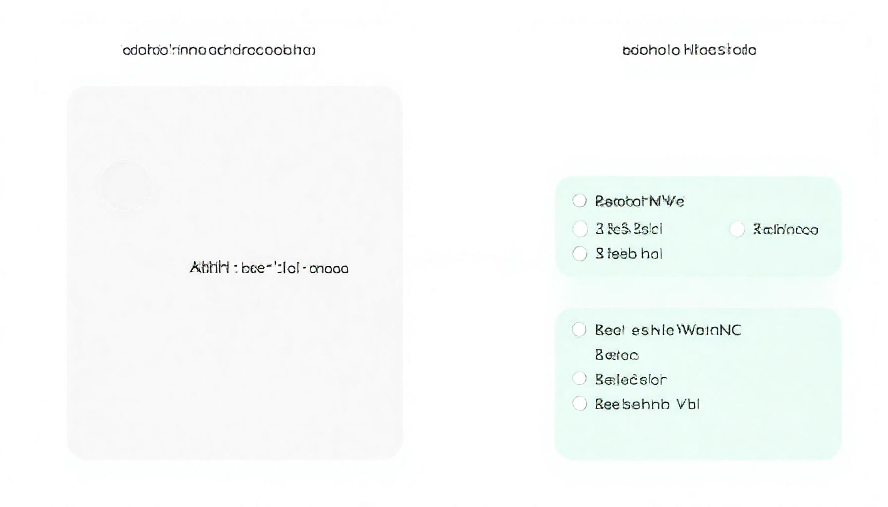

# Browserless with Login Station

**Authenticated web scraping via a Chrome instance you control — no cookie extraction needed.**

Two containers that share the **same Chrome instance**:

- **`login-station`** — KasmVNC browser where you sign into any site manually
- **`browserless`** — Headless Chrome API (Playwright-compatible) that inherits those sessions

When you log into LinkedIn, GitHub, or any site via `login.YOUR_DOMAIN`, the `browserless` API automatically uses the same authenticated session. No cookie extraction, no encryption hacks, no secret key management.

---

## Architecture

> **Interactive diagram:** [Open in Excalidraw](https://excalidraw.saumitra1912.com) — or import `docs/architecture-diagram.excalidraw.json` into any Excalidraw instance.



### Why this works

Chromium v120+ encrypts cookies with AES-256-GCM using a key derived from your OS credential store. The SQLite `value` column is always empty — extracting cookies is impossible without that key.

CDP bypasses this entirely: we connect directly to the Chrome instance that holds the decrypted session. Both containers share the same Chrome process, so sessions are inherited automatically.

---

## Prerequisites

- **Docker** (v24+) with Docker Compose v2
- **Docker network `nginx-proxy`** — create it with:
  ```bash
  docker network create nginx-proxy
  ```
- **SSL certificates** — Generate via Let's Encrypt (DNS-01 challenge) or bring your own
- **Nginx reverse proxy** — with volume mounts for your SSL certs (see [Nginx Setup](#nginx-setup))

---

## Quick Start

### 1. Clone / copy files

```bash
git clone https://github.com/YOUR_GITHUB/browserless-with-login-station-docker.git
cd browserless-with-login-station-docker
```

### 2. Configure environment

```bash
cp .env.example .env
# Edit .env — at minimum set:
#   DOMAIN                  (your domain)
#   BROWSERLESS_DOMAIN      (e.g. browserless.yourdomain.com)
#   LOGIN_DOMAIN            (e.g. login.yourdomain.com)
#   SCRAPE_DOMAIN           (e.g. scrape.yourdomain.com)
#   BROWSERLESS_TOKEN       (openssl rand -hex 32)
```

### 3. Build the login-station image

```bash
docker compose build login-station
```

### 4. Start everything

```bash
docker compose up -d
```

### 5. Sign in

Open `https://login.YOUR_DOMAIN` in your browser → log into any site (LinkedIn, GitHub, etc.) → wait a few seconds for cookies to settle.

### 6. Test authenticated scraping

```bash
# Via auth-proxy scrape API (uses same Chrome session)
curl -X POST http://127.0.0.1:3100/scrape \
  -H "Content-Type: application/json" \
  -d '{"url":"https://www.linkedin.com/feed/","waitAfter":5000}'

# Via browserless headless API (Playwright-compatible WS)
# Connect to ws://127.0.0.1:3000/playwright/chromium?token=YOUR_TOKEN
```

---

## Services

### Login Station (`login-station`)

| Port | Service | Description |
|------|---------|-------------|
| 3100 | Auth-Proxy HTTP | Authenticated scrape REST API |
| 9224 | CDP WS Proxy | WebSocket tunnel to Chrome (for `CONNECTION_WS_ENDPOINT`) |
| 3000 | KasmVNC | Web interface (nginx routes `login.` subdomain here) |

### Browserless (`browserless`)

| Port | Service | Description |
|------|---------|-------------|
| 3000 | Browserless WS API | Headless Chrome for Playwright/MCP clients |

---

## API Reference

### Auth-Proxy Scrape API (recommended for authenticated scraping)

```bash
# POST — returns JSON with html, title, finalUrl
curl -X POST http://127.0.0.1:3100/scrape \
  -H "Content-Type: application/json" \
  -d '{
    "url": "https://www.linkedin.com/in/your-profile/",
    "waitAfter": 5000,
    "waitUntil": "networkidle2",
    "timeout": 30000
  }'

# GET — returns raw HTML
curl "http://127.0.0.1:3100/scrape?url=https://github.com/you&waitAfter=3000"

# Health check
curl http://127.0.0.1:3100/health
```

**Parameters:**

| Param | Type | Default | Description |
|-------|------|---------|-------------|
| `url` | string | required | Target URL |
| `waitAfter` | int | 2000 | Extra wait after page load (ms) |
| `waitUntil` | string | `networkidle2` | Puppeteer waitUntil: `load`, `domcontentloaded`, `networkidle0`, `networkidle2` |
| `timeout` | int | 30000 | Navigation timeout (ms) |

**Returns:**
```json
{
  "success": true,
  "html": "<!doctype html>...",
  "title": "Profile | LinkedIn",
  "finalUrl": "https://www.linkedin.com/in/you/"
}
```

### Browserless Headless API (Playwright-compatible)

```bash
# Health check (requires token)
curl -H "Authorization: Bearer YOUR_TOKEN" \
  http://127.0.0.1:3000/pressure

# WebSocket — use with Playwright, MCP, or any CDP-compatible client
ws://127.0.0.1:3000/playwright/chromium?token=YOUR_TOKEN
```

---

## Nginx Setup

This repo includes nginx config templates in `nginx/`. Copy them to your nginx-proxy `conf.d/` directory and update:

1. **`server_name`** — set your subdomains
2. **`ssl_certificate` / `ssl_certificate_key`** — paths to your SSL certs
3. Add cert volume mounts to your nginx `docker-compose.yml`

```bash
# Example: add these volumes to your nginx-proxy service
volumes:
  - /etc/letsencrypt/live/browserless.YOUR_DOMAIN:/etc/ssl/certs/browserless:ro
  - /etc/letsencrypt/live/login.YOUR_DOMAIN:/etc/ssl/certs/login-browserless:ro
  - /etc/letsencrypt/live/scrape.YOUR_DOMAIN:/etc/ssl/certs/scrape-browserless:ro

# Restart nginx
docker compose -f nginx-proxy/docker-compose.yml restart nginx
```

### DNS Records

Create CNAME records pointing to your server:

```
browserless  IN CNAME  pi5.YOUR_DOMAIN.   (or your server A record)
login        IN CNAME  pi5.YOUR_DOMAIN.
scrape       IN CNAME  pi5.YOUR_DOMAIN.
```

---

## Environment Variables

| Variable | Default | Description |
|----------|---------|-------------|
| `BROWSERLESS_TOKEN` | *(required)* | Secret token for browserless API auth |
| `BROWSERLESS_DOMAIN` | *(required)* | Subdomain for browserless WS API |
| `LOGIN_DOMAIN` | *(required)* | Subdomain for KasmVNC login UI |
| `SCRAPE_DOMAIN` | *(required)* | Subdomain for auth-proxy scrape API |
| `PUID` / `PGID` | 1000 | User/group ID for file permissions |
| `TZ` | Asia/Kolkata | Timezone |
| `DISPLAY_WIDTH` | 1920 | KasmVNC display width |
| `DISPLAY_HEIGHT` | 1080 | KasmVNC display height |
| `BROWSERLESS_CONCURRENT` | 5 | Max concurrent browser sessions |
| `BROWSERLESS_TIMEOUT` | 600000 | Session timeout (ms) |

---

## Troubleshooting

```bash
# Check containers are running
docker ps --filter "name=browserless"

# Check login station logs
docker logs login-station --tail 50

# Check browserless logs
docker logs browserless --tail 50

# Verify Chrome CDP is reachable from auth-proxy
curl http://127.0.0.1:9224/json/version | python3 -m json.tool

# Health check auth-proxy
curl http://127.0.0.1:3100/health

# Health check browserless
curl -H "Authorization: Bearer YOUR_TOKEN" http://127.0.0.1:3000/pressure

# Check Docker network
docker network inspect nginx-proxy
```

### Login station returning blank / black screen
- KasmVNC in linuxserver/chromium needs `--security-opt seccomp=unconfined` and `--group-add 105` (video group)
- Both are set in `docker-compose.yml` — don't remove them

### Auth-proxy returns "No webSocketDebuggerUrl"
- Chrome CDP isn't ready yet — the s6 service waits up to 90s
- Check: `docker logs login-station | grep "Chrome CDP ready"`

### Browserless sessions not authenticated
- Make sure you signed into the site via `login.YOUR_DOMAIN` (KasmVNC), not the browserless headless API
- Wait ~5s after signing in for cookies to fully settle before scraping

### Feed pages returning "Something went wrong"
- Many sites (LinkedIn, Twitter/X) are heavily client-side rendered
- Try increasing `waitAfter` to 8000–12000ms and `waitUntil: "networkidle0"`
- Sites may also rate-limit — try again after a short wait

---

## File Structure

```
.
├── docker-compose.yml              # Main compose (both services)
├── Dockerfile.login-station       # Custom image: linuxserver/chromium + auth-proxy
├── auth-proxy/
│   ├── auth-proxy.js               # Node.js: CDP scrape API + WS proxy
│   └── package.json
├── docker/
│   └── s6-auth-proxy/
│       ├── run                     # s6 run script (waits for Chrome, starts auth-proxy)
│       ├── type                    # "longrun" — s6 managed daemon
│       └── dependencies.d/
│           └── svc-de             # Empty — tells s6 this depends on Chrome
├── nginx/
│   ├── browserless.conf            # Nginx config for browserless.YOUR_DOMAIN
│   └── login-browserless.conf      # Nginx config for login.YOUR_DOMAIN + scrape.YOUR_DOMAIN
├── docs/
│   ├── architecture-diagram.jpg          # PNG render of the architecture diagram
│   └── architecture-diagram.excalidraw.json  # Interactive Excalidraw source
├── .env.example                    # Environment template
├── .gitignore
├── .dockerignore
└── README.md
```

---

## Credits

- Auth-proxy CDP scraping pattern inspired by browserless.io architecture
- Base images: [linuxserver/chromium](https://docs.linuxserver.io/images/docker-chromium), [ghcr.io/browserless/chromium](https://github.com/browserless/chromium)