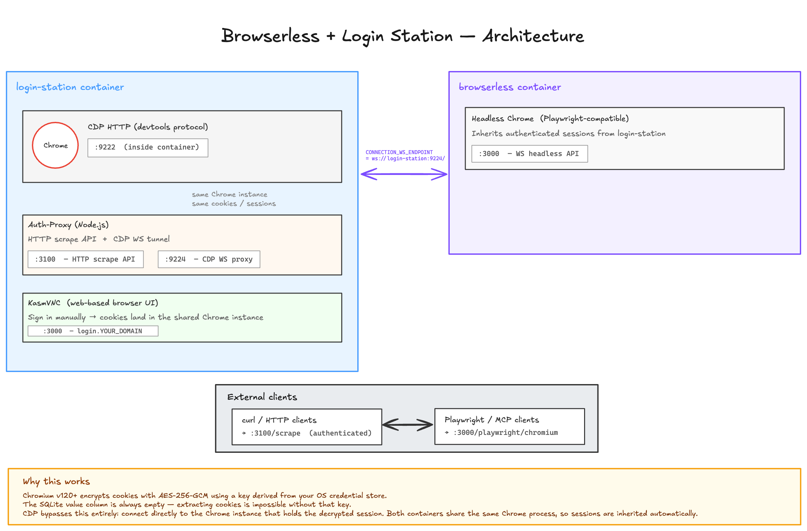

# Browserless with Login Station

**Authenticated web scraping via a Chrome instance you control — no cookie extraction needed.**

Two containers that share the **same Chrome instance**:

- **`login-station`** — KasmVNC browser where you sign into any site manually
- **`browserless`** — Headless Chrome API (Playwright-compatible) that inherits those sessions

When you log into LinkedIn, GitHub, or any site via `login.YOUR_DOMAIN`, the `browserless` API automatically uses the same authenticated session. No cookie extraction, no encryption hacks, no secret key management.

---

## Architecture

> **Interactive diagram:** [Open in Excalidraw](https://excalidraw.com/) — or import `docs/architecture-diagram.excalidraw.json` into any Excalidraw instance.



### Why this works

Chromium v120+ encrypts cookies with AES-256-GCM using a key derived from your OS credential store. The SQLite `value` column is always empty — extracting cookies is impossible without that key.

CDP bypasses this entirely: we connect directly to the Chrome instance that holds the decrypted session. Both containers share the same Chrome process, so sessions are inherited automatically.

---

## Prerequisites

- **Docker** (v24+) with Docker Compose v2
- **OpenSSL** — to generate a browserless token: `openssl rand -hex 32`

No external nginx-proxy, no SSL certs, no DNS records needed for local development.

---

## Quick Start

### 1. Clone / copy files

```bash
git clone https://github.com/YOUR_GITHUB/browserless-with-login-station-docker.git
cd browserless-with-login-station-docker
```

### 2. Configure environment

```bash
cp .env.example .env
# At minimum set BROWSERLESS_TOKEN:
#   BROWSERLESS_TOKEN=$(openssl rand -hex 32)
```

**That's it for local development** — `USE_SSL=false` is the default. Everything runs on `127.0.0.1` with plain HTTP.

### 3. Build the login-station image

```bash
docker compose build login-station
```

### 4. Start everything

```bash
docker compose up -d
```

### 5. Sign in

Open `http://127.0.0.1:3100` in your browser → log into any site (LinkedIn, GitHub, etc.) → wait a few seconds for cookies to settle.

### 6. Test authenticated scraping

```bash
# Via auth-proxy scrape API
curl -X POST http://127.0.0.1:3100/scrape \
  -H "Content-Type: application/json" \
  -d '{"url":"https://www.linkedin.com/feed/","waitAfter":5000}'

# Via browserless headless API (Playwright-compatible WS)
# Connect to ws://127.0.0.1:3000/playwright/chromium?token=YOUR_TOKEN
```

---

## Production Mode (HTTPS)

To enable HTTPS, set these in `.env`:

```bash
USE_SSL=true
DOMAIN=yourdomain.com
LOGIN_DOMAIN=login.yourdomain.com
SCRAPE_DOMAIN=scrape.yourdomain.com
BROWSERLESS_DOMAIN=browserless.yourdomain.com
SSL_CERT_PATH=/path/to/fullchain.pem
SSL_KEY_PATH=/path/to/privkey.pem
```

Then start with the `ssl` profile:

```bash
# Build image
docker compose build login-station

# Start all services including nginx (TLS on 80/443)
docker compose --profile ssl up -d
```

Create DNS A records pointing to your server for `login.`, `scrape.`, and `browserless.` subdomains, then generate SSL certificates (e.g. Let's Encrypt with DNS-01 challenge).

---

## Services

### Login Station (`login-station`)

| Port | Service | Description |
|------|---------|-------------|
| 3100 | KasmVNC + Auth-Proxy | Web UI + authenticated scrape API |
| 9224 | CDP WS Proxy | WebSocket tunnel to Chrome (for `CONNECTION_WS_ENDPOINT`) |

### Browserless (`browserless`)

| Port | Service | Description |
|------|---------|-------------|
| 3000 | Browserless WS API | Headless Chrome for Playwright/MCP clients |

### Nginx (`nginx-proxy`) — production only

Started with `--profile ssl`. Routes HTTPS subdomains to the above services.

---

## API Reference

### Auth-Proxy Scrape API (recommended for authenticated scraping)

```bash
# POST — returns JSON with html, title, finalUrl
curl -X POST http://127.0.0.1:3100/scrape \
  -H "Content-Type: application/json" \
  -d '{
    "url": "https://www.linkedin.com/in/your-profile/",
    "waitAfter": 5000,
    "waitUntil": "networkidle2",
    "timeout": 30000
  }'

# GET — returns raw HTML
curl "http://127.0.0.1:3100/scrape?url=https://github.com/you&waitAfter=3000"

# Health check
curl http://127.0.0.1:3100/health
```

**Parameters:**

| Param | Type | Default | Description |
|-------|------|---------|-------------|
| `url` | string | required | Target URL |
| `waitAfter` | int | 2000 | Extra wait after page load (ms) |
| `waitUntil` | string | `networkidle2` | Puppeteer waitUntil: `load`, `domcontentloaded`, `networkidle0`, `networkidle2` |
| `timeout` | int | 30000 | Navigation timeout (ms) |

**Returns:**
```json
{
  "success": true,
  "html": "<!doctype html>...",
  "title": "Profile | LinkedIn",
  "finalUrl": "https://www.linkedin.com/in/you/"
}
```

### Browserless Headless API (Playwright-compatible)

```bash
# Health check (requires token)
curl -H "Authorization: Bearer YOUR_TOKEN" \
  http://127.0.0.1:3000/pressure

# WebSocket — use with Playwright, MCP, or any CDP-compatible client
ws://127.0.0.1:3000/playwright/chromium?token=YOUR_TOKEN
```

---

## Nginx Setup (built-in, production mode)

nginx is included in this repo as a containerized reverse proxy. It is **only started when `USE_SSL=true`** (`--profile ssl`).

Templates in `nginx/`:
- **`nginx.conf.http`** — HTTP-only config for local dev
- **`nginx.conf.https`** — HTTPS config with TLS termination
- **`setup.sh`** — selects and starts the right config at runtime

SSL cert paths are passed via `SSL_CERT_PATH` / `SSL_KEY_PATH` env vars and volume-mounted into the nginx container. See `.env.example` for the full set of SSL-related variables.

### DNS Records

Create A/CNAME records pointing to your server:

```
login        IN CNAME  your-server.
scrape       IN CNAME  your-server.
browserless  IN CNAME  your-server.
```

---

## Environment Variables

| Variable | Default | Description |
|----------|---------|-------------|
| `USE_SSL` | `false` | Set `true` to enable HTTPS via nginx (use `--profile ssl`) |
| `DOMAIN` | — | Top-level domain (used to build subdomain defaults) |
| `LOGIN_DOMAIN` | `login.${DOMAIN}` | Subdomain for KasmVNC web UI |
| `SCRAPE_DOMAIN` | `scrape.${DOMAIN}` | Subdomain for auth-proxy scrape API |
| `BROWSERLESS_DOMAIN` | `browserless.${DOMAIN}` | Subdomain for browserless WS API |
| `SSL_CERT_PATH` | — | Path to SSL fullchain.pem (required when `USE_SSL=true`) |
| `SSL_KEY_PATH` | — | Path to SSL privkey.pem (required when `USE_SSL=true`) |
| `BROWSERLESS_TOKEN` | *(set in .env)* | Secret token for browserless API auth |
| `PUID` / `PGID` | 1000 | User/group ID for file permissions |
| `TZ` | `UTC` | Timezone |
| `DISPLAY_WIDTH` | 1920 | KasmVNC display width |
| `DISPLAY_HEIGHT` | 1080 | KasmVNC display height |
| `BROWSERLESS_CONCURRENT` | 5 | Max concurrent browser sessions |
| `BROWSERLESS_TIMEOUT` | 600000 | Session timeout (ms) |
| `AUTH_PROXY_HOST_PORT` | `127.0.0.1:3100` | Host port for auth-proxy / KasmVNC |
| `CDP_HOST_PORT` | `127.0.0.1:9224` | Host port for CDP WebSocket proxy |
| `BROWSERLESS_HOST_PORT` | `127.0.0.1:3000` | Host port for browserless headless API |

---

## Troubleshooting

```bash
# Check containers are running
docker ps --filter "name=browserless,login-station"

# Check login station logs
docker logs login-station --tail 50

# Check browserless logs
docker logs browserless --tail 50

# Check nginx logs (when USE_SSL=true)
docker logs nginx-proxy --tail 50

# Verify Chrome CDP is reachable from auth-proxy
curl http://127.0.0.1:9224/json/version | python3 -m json.tool

# Health check auth-proxy
curl http://127.0.0.1:3100/health

# Health check browserless
curl -H "Authorization: Bearer YOUR_TOKEN" http://127.0.0.1:3000/pressure
```

### Login station returning blank / black screen
- KasmVNC in linuxserver/chromium needs `--security-opt seccomp=unconfined` and `--group-add 105` (video group)
- Both are set in `docker-compose.yml` — don't remove them

### Auth-proxy returns "No webSocketDebuggerUrl"
- Chrome CDP isn't ready yet — the s6 service waits up to 90s
- Check: `docker logs login-station | grep "Chrome CDP ready"`

### Browserless sessions not authenticated
- Make sure you signed into the site via `login.YOUR_DOMAIN` (KasmVNC), not the browserless headless API
- Wait ~5s after signing in for cookies to fully settle before scraping

### Feed pages returning "Something went wrong"
- Many sites (LinkedIn, Twitter/X) are heavily client-side rendered
- Try increasing `waitAfter` to 8000–12000ms and `waitUntil: "networkidle0"`
- Sites may also rate-limit — try again after a short wait

---

## File Structure

```
.
├── docker-compose.yml              # Main compose — local dev + production modes
│                                 # Start with --profile ssl for HTTPS
├── Dockerfile.login-station       # Custom image: linuxserver/chromium + auth-proxy
├── setup.sh                       # nginx entrypoint — picks HTTP or HTTPS config
├── auth-proxy/
│   ├── auth-proxy.js               # Node.js: CDP scrape API + WS proxy
│   └── package.json
├── docker/
│   └── s6-auth-proxy/
│       ├── run                     # s6 run script (waits for Chrome, starts auth-proxy)
│       ├── type                    # "longrun" — s6 managed daemon
│       └── dependencies.d/
│           └── svc-de             # Empty — tells s6 this depends on Chrome
├── nginx/
│   ├── nginx.conf.http            # HTTP-only config (USE_SSL=false)
│   ├── nginx.conf.https           # HTTPS config with TLS (USE_SSL=true)
│   └── proxy-headers.conf         # Shared proxy header snippet
├── docs/
│   ├── architecture-diagram.png          # PNG export of the architecture diagram
│   └── architecture-diagram.excalidraw.json  # Interactive Excalidraw source
├── .github/
│   └── workflows/
│       └── build-push.yml         # CI: builds login-station, pushes to GHCR
├── .env.example                   # Environment template
├── .gitignore
├── .dockerignore
└── README.md
```

---

## Deploying to GHCR

This repo includes a GitHub Actions workflow that builds and pushes the `login-station` image to GHCR.

### Setup

1. **Fork this repo** (or push to your own GitHub repo)
2. **Update `GITHUB_REPO`** in `.env.example` to your GitHub handle
3. The workflow auto-authenticates to GHCR via GitHub's OIDC — no secrets needed

### Image tags

| Trigger | Tags |
|---------|------|
| Push to `main` | `latest`, `sha-<sha7>` |
| Tag `v1.2.3` | `v1.2.3`, `v1.2`, `v1`, `latest` |
| Pull request | builds but does **not** push |

### Using the GHCR image in production

In your `docker-compose.yml`, comment out the `build:` block on the `login-station` service and uncomment the `image:` line with your GHCR URL:

```yaml
login-station:
  # build:
  #   context: .
  #   dockerfile: Dockerfile.login-station
  image: ghcr.io/YOUR_HANDLE/browserless-login-station:latest
```

Then `docker compose pull` to fetch the latest image.

---

## Credits

- Auth-proxy CDP scraping pattern inspired by browserless.io architecture
- Base images: [linuxserver/chromium](https://docs.linuxserver.io/images/docker-chromium), [ghcr.io/browserless/chromium](https://github.com/browserless/chromium)