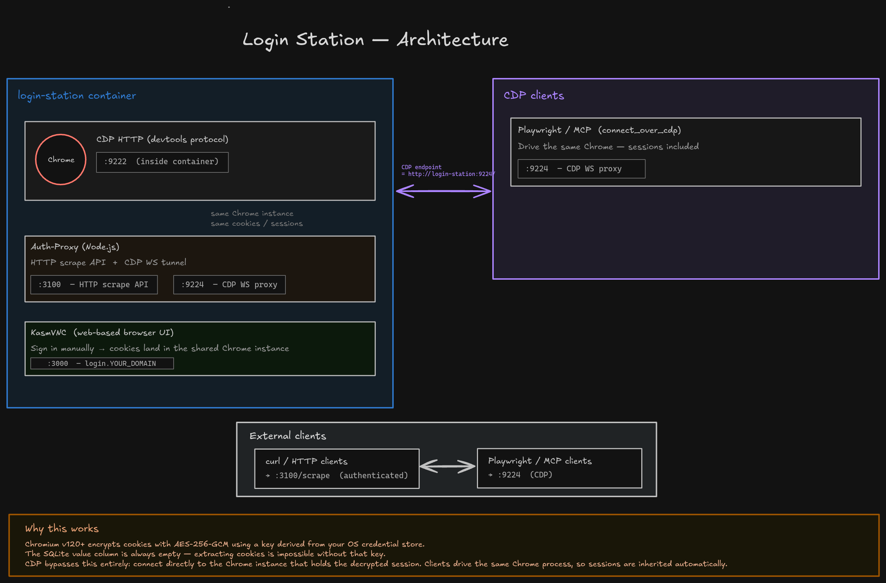

# Login Station

**Authenticated web scraping via a Chrome instance you control — no cookie extraction needed.**

A single `login-station` container (KasmVNC browser + auth-proxy + CDP proxy) where you sign into any site manually. Drive that **same Chrome** over CDP with Playwright/MCP and the sessions come along automatically.

When you log into LinkedIn, GitHub, or any site via `login.YOUR_DOMAIN`, any CDP client connected to the station automatically uses the same authenticated session. No cookie extraction, no encryption hacks, no secret key management.

---

## Architecture

> **Interactive diagram:** [Open in Excalidraw](https://excalidraw.com/) — or import `docs/architecture-diagram.excalidraw.json` into any Excalidraw instance.



### Why this works

Chromium v120+ encrypts cookies with AES-256-GCM using a key derived from your OS credential store. The SQLite `value` column is always empty — extracting cookies is impossible without that key.

CDP bypasses this entirely: we connect directly to the Chrome instance that holds the decrypted session. CDP clients drive the same Chrome process, so sessions are inherited automatically.

---

## Prerequisites

- **Docker** (v24+) with Docker Compose v2

No external nginx-proxy, no SSL certs, no DNS records needed for local development.

---

## Quick Start

### 1. Clone / copy files

```bash
git clone https://github.com/YOUR_GITHUB/browserless-with-login-station-docker.git
cd browserless-with-login-station-docker
```

### 2. Configure environment

```bash
cp .env.example .env
```

**That's it for local development** — `USE_SSL=false` is the default. Everything runs on `127.0.0.1` with plain HTTP.

### 3. Start everything

```bash
docker compose up -d
```

This pulls the pre-built `login-station` image from GHCR — no build step needed.

### 4. Sign in

Open `http://127.0.0.1:3001` in your browser → log into any site (LinkedIn, GitHub, etc.) → wait a few seconds for cookies to settle.

### 5. Test authenticated scraping

```bash
# Via auth-proxy scrape API
curl -X POST http://127.0.0.1:3100/scrape \
  -H "Content-Type: application/json" \
  -d '{"url":"https://www.linkedin.com/feed/","waitAfter":5000}'

# Via login-station Chrome CDP (Playwright / MCP)
# Connect to http://127.0.0.1:9224 with connect_over_cdp (see recipe below)
curl http://127.0.0.1:9224/json/version | python3 -m json.tool
```

---

## Building Locally

If you need to customize or debug the `login-station` image, use `docker-compose.prod.yml` which builds from `Dockerfile.login-station`:

```bash
# Build the image
docker compose -f docker-compose.prod.yml build login-station

# Start everything
docker compose -f docker-compose.prod.yml up -d
```

---

## Production Mode (HTTPS)

To enable HTTPS, set these in `.env`:

```bash
USE_SSL=true
DOMAIN=yourdomain.com
LOGIN_DOMAIN=login.yourdomain.com
SCRAPE_DOMAIN=scrape.yourdomain.com
SSL_CERT_PATH=/path/to/fullchain.pem
SSL_KEY_PATH=/path/to/privkey.pem
```

Then start with the `ssl` profile:

```bash
# Start all services including nginx (TLS on 80/443)
docker compose --profile ssl up -d
```

If building locally instead of using the GHCR image:

```bash
docker compose -f docker-compose.prod.yml --profile ssl up -d
```

Create DNS A records pointing to your server for `login.` and `scrape.` subdomains, then generate SSL certificates (e.g. Let's Encrypt with DNS-01 challenge).

---

## Services

### Login Station (`login-station`)

| Port | Service | Description |
|------|---------|-------------|
| 3001 | KasmVNC | Web UI — sign into sites here |
| 3100 | Auth-Proxy | Scrape API + health check |
| 9224 | CDP WS Proxy | WebSocket tunnel to Chrome for Playwright/MCP (`connect_over_cdp`) |

Chrome auto-restarts if its process exits (`RESTART_APP=true` default) — a killed browser comes back with the same profile/sessions.

### Nginx (`nginx-proxy`) — production only

Started with `--profile ssl`. Routes HTTPS subdomains to the above services.

---

## API Reference

### Auth-Proxy Scrape API (recommended for authenticated scraping)

```bash
# POST — returns JSON with html, title, finalUrl
curl -X POST http://127.0.0.1:3100/scrape \
  -H "Content-Type: application/json" \
  -d '{
    "url": "https://www.linkedin.com/in/your-profile/",
    "waitAfter": 5000,
    "waitUntil": "networkidle2",
    "timeout": 30000
  }'

# GET — returns raw HTML
curl "http://127.0.0.1:3100/scrape?url=https://github.com/you&waitAfter=3000"

# Health check
curl http://127.0.0.1:3100/health
```

**Parameters:**

| Param | Type | Default | Description |
|-------|------|---------|-------------|
| `url` | string | required | Target URL |
| `waitAfter` | int | 2000 | Extra wait after page load (ms) |
| `waitUntil` | string | `networkidle2` | Puppeteer waitUntil: `load`, `domcontentloaded`, `networkidle0`, `networkidle2` |
| `timeout` | int | 30000 | Navigation timeout (ms) |

**Returns:**
```json
{
  "success": true,
  "html": "<!doctype html>...",
  "title": "Profile | LinkedIn",
  "finalUrl": "https://www.linkedin.com/in/you/"
}
```

### Authenticated scraping with Playwright (recommended)

Point Playwright straight at the **login-station Chrome** (via its CDP proxy) and you get full
Playwright control **with** the signed-in sessions you set up via the login UI — no cookie
extraction, no sharing hack:

```python
from playwright.async_api import async_playwright

async with async_playwright() as pw:
    # Local (on the host):          "http://127.0.0.1:9224"
    # Remote (Tailnet / via nginx): "https://login.browserless.saumitra1912.com"
    browser = await pw.chromium.connect_over_cdp("https://login.browserless.saumitra1912.com")

    ctx = browser.contexts[0]          # the login-station Chrome (already signed in)
    page = await ctx.new_page()        # new tabs share the auth session
    await page.goto("https://www.linkedin.com/feed/")
    # ... scrape authenticated content ...

    # ...or read the already-open, logged-in tabs directly:
    for p in ctx.pages:
        print(p.url, (await p.title()))
```

- The login-station Chrome is reachable via the CDP proxy on host port `9224`.
- On a Tailnet-only box this is exposed over your reverse proxy so `login.YOUR_DOMAIN`
  doubles as the CDP endpoint (see `nginx/` templates: `/json` + `/devtools/` locations).
- Any device on the Tailnet can connect, so keep the Tailnet trusted.

---

## AI Agent Integration (MCP)

Connect an AI coding agent (GitHub Copilot, Claude, Cursor, etc.) to your authenticated Chrome instance via the [Model Context Protocol](https://modelcontextprotocol.io/) (MCP). The agent can then navigate pages, read content, and interact with sites using the sessions you signed into via KasmVNC.

Add this to your MCP client's configuration (e.g. VS Code `mcp.json`, Claude Desktop config):

```json
"playwright": {
  "command": "npx",
  "args": [
    "-y",
    "@playwright/mcp@latest",
    "--cdp-endpoint",
    "http://localhost:9224/",
    "--snapshot-mode=none"
  ]
}
```

This points the Playwright MCP server at the CDP WebSocket proxy on `login-station`. Any page the agent opens inherits your authenticated sessions — no extra setup needed.

---

## Nginx Setup (built-in, production mode)

nginx is included in this repo as a containerized reverse proxy. It is **only started when `USE_SSL=true`** (`--profile ssl`).

Templates in `nginx/`:
- **`nginx.conf.http`** — HTTP-only config for local dev
- **`nginx.conf.https`** — HTTPS config with TLS termination
- **`setup.sh`** — selects and starts the right config at runtime

SSL cert paths are passed via `SSL_CERT_PATH` / `SSL_KEY_PATH` env vars and volume-mounted into the nginx container. See `.env.example` for the full set of SSL-related variables.

### DNS Records

Create A/CNAME records pointing to your server:

```
login        IN CNAME  your-server.
scrape       IN CNAME  your-server.
```

---

## Environment Variables

| Variable | Default | Description |
|----------|---------|-------------|
| `USE_SSL` | `false` | Set `true` to enable HTTPS via nginx (use `--profile ssl`) |
| `DOMAIN` | — | Top-level domain (used to build subdomain defaults) |
| `LOGIN_DOMAIN` | `login.${DOMAIN}` | Subdomain for KasmVNC web UI |
| `SCRAPE_DOMAIN` | `scrape.${DOMAIN}` | Subdomain for auth-proxy scrape API |
| `SSL_CERT_PATH` | — | Path to SSL fullchain.pem (required when `USE_SSL=true`) |
| `SSL_KEY_PATH` | — | Path to SSL privkey.pem (required when `USE_SSL=true`) |
| `RESTART_APP` | `true` | Auto-restart Chrome if its process exits |
| `PUID` / `PGID` | 1000 | User/group ID for file permissions |
| `TZ` | `UTC` | Timezone |
| `DISPLAY_WIDTH` | 1920 | KasmVNC display width |
| `DISPLAY_HEIGHT` | 1080 | KasmVNC display height |
| `KASMVNC_HOST_PORT` | `127.0.0.1:3001` | Host port for KasmVNC web UI |
| `AUTH_PROXY_HOST_PORT` | `127.0.0.1:3100` | Host port for auth-proxy scrape API |
| `CDP_HOST_PORT` | `127.0.0.1:9224` | Host port for CDP WebSocket proxy |

---

## Troubleshooting

```bash
# Check the container is running
docker ps --filter "name=login-station"

# Check login station logs
docker logs login-station --tail 50

# Check nginx logs (when USE_SSL=true)
docker logs nginx-proxy --tail 50

# Verify KasmVNC is running
curl -s http://127.0.0.1:3001 | head -5

# Verify Chrome CDP is reachable from auth-proxy
curl http://127.0.0.1:9224/json/version | python3 -m json.tool

# Health check auth-proxy
curl http://127.0.0.1:3100/health
```

### Login station returning blank / black screen
- KasmVNC in linuxserver/chromium needs `--security-opt seccomp=unconfined` and `--group-add 105` (video group)
- Both are set in `docker-compose.yml` — don't remove them

### Auth-proxy returns "No webSocketDebuggerUrl"
- Chrome CDP isn't ready yet — the s6 service waits up to 90s
- Check: `docker logs login-station | grep "Chrome CDP ready"`

### Chrome keeps dying / CDP unreachable
- The watchdog restarts Chrome automatically (`RESTART_APP=true` default) — check:
  `docker logs login-station | grep -i watchdog`
- If Chrome stays dead, make sure `RESTART_APP` wasn't overridden to `false`
- **Never send `Browser.close` over the shared CDP session** — it terminates the
  whole browser. Close only your own pages/tabs; the watchdog recovers if it happens.

### Playwright errors over direct CDP
Client and server versions can drift (no bundled driver to pin against anymore). If you see
protocol errors (`KeyError`, unexpected `undefined`), upgrade your Playwright client to a
recent version matching the Chrome build in the station image.

> Note: `fetch()` from a page to a *cross-origin* host returns `TypeError: Failed to fetch` when the target doesn't
> send `Access-Control-Allow-Origin` — that's normal browser CORS, not an egress fault. Same-origin fetches and
> normal navigation (`.goto()`) are unaffected.

### Feed pages returning "Something went wrong"
- Many sites (LinkedIn, Twitter/X) are heavily client-side rendered
- Try increasing `waitAfter` to 8000–12000ms and `waitUntil: "networkidle0"`
- Sites may also rate-limit — try again after a short wait

---

## File Structure

```
.
├── docker-compose.yml              # Default — uses pre-built GHCR image
├── docker-compose.prod.yml         # Local build — builds from Dockerfile.login-station
├── Dockerfile.login-station       # Custom image: linuxserver/chromium + auth-proxy
├── setup.sh                       # nginx entrypoint — picks HTTP or HTTPS config
├── auth-proxy/
│   ├── auth-proxy.js               # Node.js: CDP scrape API + WS proxy
│   └── package.json
├── docker/
│   └── s6-auth-proxy/
│       ├── run                     # s6 run script (waits for Chrome, starts auth-proxy)
│       ├── type                    # "longrun" — s6 managed daemon
│       └── dependencies.d/
│           └── svc-de             # Empty — tells s6 this depends on Chrome
├── nginx/
│   ├── nginx.conf.http            # HTTP-only config (USE_SSL=false)
│   ├── nginx.conf.https           # HTTPS config with TLS (USE_SSL=true)
│   └── proxy-headers.conf         # Shared proxy header snippet
├── docs/
│   ├── architecture-diagram.png          # PNG export of the architecture diagram
│   └── architecture-diagram.excalidraw.json  # Interactive Excalidraw source
├── version.txt                    # Version source of truth — bump here to trigger release
├── .github/
│   └── workflows/
│       └── build-push.yml         # CI: builds login-station, pushes to GHCR
├── .env.example                   # Environment template
├── .gitignore
├── .dockerignore
└── README.md
```

---

## Deploying to GHCR

This repo includes a GitHub Actions workflow that builds and releases the `login-station` image to GHCR.

### Version management

All version numbers live in **`version.txt`** at the repo root. The workflow reads this file to determine what to release — no manual git tags needed.

| Action | Result |
|--------|--------|
| Edit `version.txt` + push | CI builds, pushes image, creates git tag + GitHub release |
| Push without changing version | CI detects matching tag exists → skips release |
| Push with `--profile ssl` | Builds again (no release) |

### Release workflow

1. `check` job reads `version.txt`, checks if `v<version>` tag already exists
2. If tag missing → `release` job runs: multi-arch build → GHCR with `v<version>` + `latest` tags → git tag → GitHub release with commit log
3. If tag exists → both jobs exit early (idempotent, safe to re-run)

### Image tags

| Tag | When it's created |
|-----|-------------------|
| `v1.0.0`, `v1.0`, `v1` | On every new version |
| `latest` | Always, on every release |

### First release

The current `version.txt` is `2.0.0`. The workflow that just ran on this push will create:
- GHCR image tagged `2.0.0` + `latest`
- Git tag `v2.0.0`
- GitHub release with the commit log

### Using the GHCR image

The default `docker-compose.yml` already uses the pre-built GHCR image:

```yaml
login-station:
  image: ghcr.io/sbtopzzz-lg/browserless-with-login-station-docker:latest
```

To pin a specific version, update the tag in `docker-compose.yml`:

```yaml
login-station:
  image: ghcr.io/SBTopZZZ-LG/browserless-with-login-station-docker:1.0.0
```

---

## Credits

- Auth-proxy CDP scraping pattern inspired by browserless.io architecture
- Base image: [linuxserver/chromium](https://docs.linuxserver.io/images/docker-chromium)